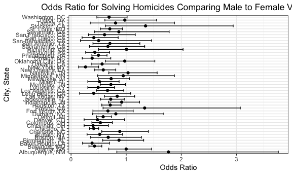

p8105_hw6_jl6321.Rmd
================

## Problem 2

Read in and manipulate the data:

``` r
homicide = read_csv("./data/homicide-data.csv") %>% 
  unite(col = "city_state", city:state, sep = ", ", remove = FALSE) %>% 
  mutate(ifsolved = ifelse(disposition == "Closed by arrest", 1, 0), 
         victim_age = as.numeric(victim_age)) %>% 
  filter(!(city_state %in% c("Dallas, TX", "Phoenix, AZ", "Kansas City, MO", "Tulsa, AL"))) %>% 
  filter(victim_race %in% c("White", "Black")) 
```

    ## Rows: 52179 Columns: 12
    ## ── Column specification ────────────────────────────────────────────────────────
    ## Delimiter: ","
    ## chr (9): uid, victim_last, victim_first, victim_race, victim_age, victim_sex...
    ## dbl (3): reported_date, lat, lon
    ## 
    ## ℹ Use `spec()` to retrieve the full column specification for this data.
    ## ℹ Specify the column types or set `show_col_types = FALSE` to quiet this message.

    ## Warning in mask$eval_all_mutate(quo): NAs introduced by coercion

Fit a logistic regression model for Baltimore:

``` r
baltimore = 
  homicide %>% 
  filter(city_state == "Baltimore, MD") 

baltimore_model = 
  baltimore %>% 
  glm(ifsolved ~ victim_age + victim_sex + victim_race, data = ., family = binomial()) 

baltimore_model %>% 
  broom::tidy() %>% 
  mutate(OR = exp(estimate), 
         lower_bound = exp(estimate - std.error * 1.96), 
         upper_bound = exp(estimate + std.error * 1.96)) %>% 
  filter(term == "victim_sexMale") %>% 
  select(term, log_OR = estimate, OR, lower_bound, upper_bound, p.value) %>% 
  rename("odds_ratio" = OR, "log_odds_ratio" = log_OR) %>% 
  knitr::kable(digits = 3)
```

| term           | log_odds_ratio | odds_ratio | lower_bound | upper_bound | p.value |
|:---------------|---------------:|-----------:|------------:|------------:|--------:|
| victim_sexMale |         -0.854 |      0.426 |       0.325 |       0.558 |       0 |

Keeping all other variables fixed, the estimate of odds ratio for
solving homicides comparing male victims to female victims is 0.426 with
a 95% confidence interval from 0.325 to 0.558, indicating that solved
male-victim homicide cases is 0.426 as solved female victim cases.

``` r
all_cities = 
  homicide %>% 
  group_by(city_state) %>% 
  nest() 

all_cities %>% 
  mutate(models = map(data, ~glm(ifsolved ~ victim_age + victim_sex + victim_race, data = .x, family = binomial())), 
         models = map(models, broom::tidy)) %>% 
  select(-data) %>% 
  unnest() %>% 
  filter(term == "victim_sexMale") %>% 
  mutate(OR = exp(estimate), 
         lower_bound = exp(estimate - std.error * 1.96), 
         upper_bound = exp(estimate + std.error * 1.96)) %>% 
  select(city_state, term, OR, lower_bound, upper_bound) %>% 
  mutate(city_state = fct_reorder(city_state, OR)) %>% 
  ggplot(aes(x = city_state, y = OR)) + 
  geom_point() + 
  geom_errorbar(mapping = aes(ymin = lower_bound, ymax = upper_bound)) + 
  coord_flip() + 
  labs(x = "City, State", y = "Odds Ratio", title = "Odds Ratio for Solving Homicides Comparing Male to Female Victims") + 
  theme_bw() + 
  theme(plot.title = element_text(hjust = 0.5)) 
```

    ## Warning: `cols` is now required when using unnest().
    ## Please use `cols = c(models)`



## Problem 3

Load and clean the data for regression analysis:

``` r
birthweight = read_csv("data/birthweight.csv") %>% 
  mutate(babysex = as.factor(babysex),
         frace = as.factor(frace), 
         malform = as.factor(malform), 
         mrace = as.factor(mrace)
         ) 
```

    ## Rows: 4342 Columns: 20
    ## ── Column specification ────────────────────────────────────────────────────────
    ## Delimiter: ","
    ## dbl (20): babysex, bhead, blength, bwt, delwt, fincome, frace, gaweeks, malf...
    ## 
    ## ℹ Use `spec()` to retrieve the full column specification for this data.
    ## ℹ Specify the column types or set `show_col_types = FALSE` to quiet this message.

``` r
sum(!complete.cases(birthweight))
```

    ## [1] 0

There is no missing data.

After conducting a quick overview of related topics’ research articles,
I have chosen several variables that seem to be influential to babies’
birthweight:

``` r
model1 = lm(bwt ~ gaweeks + mrace + malform + pnumlbw + ppbmi, data = birthweight) 
model1 %>% 
  broom::tidy() %>% 
  select(term, estimate, p.value) %>% 
  knitr::kable(digits = 3) 
```

| term        | estimate | p.value |
|:------------|---------:|--------:|
| (Intercept) |  555.919 |   0.000 |
| gaweeks     |   59.300 |   0.000 |
| mrace2      | -250.877 |   0.000 |
| mrace3      |  -77.772 |   0.263 |
| mrace4      | -165.496 |   0.000 |
| malform1    |  -25.959 |   0.823 |
| pnumlbw     |       NA |      NA |
| ppbmi       |   15.806 |   0.000 |
